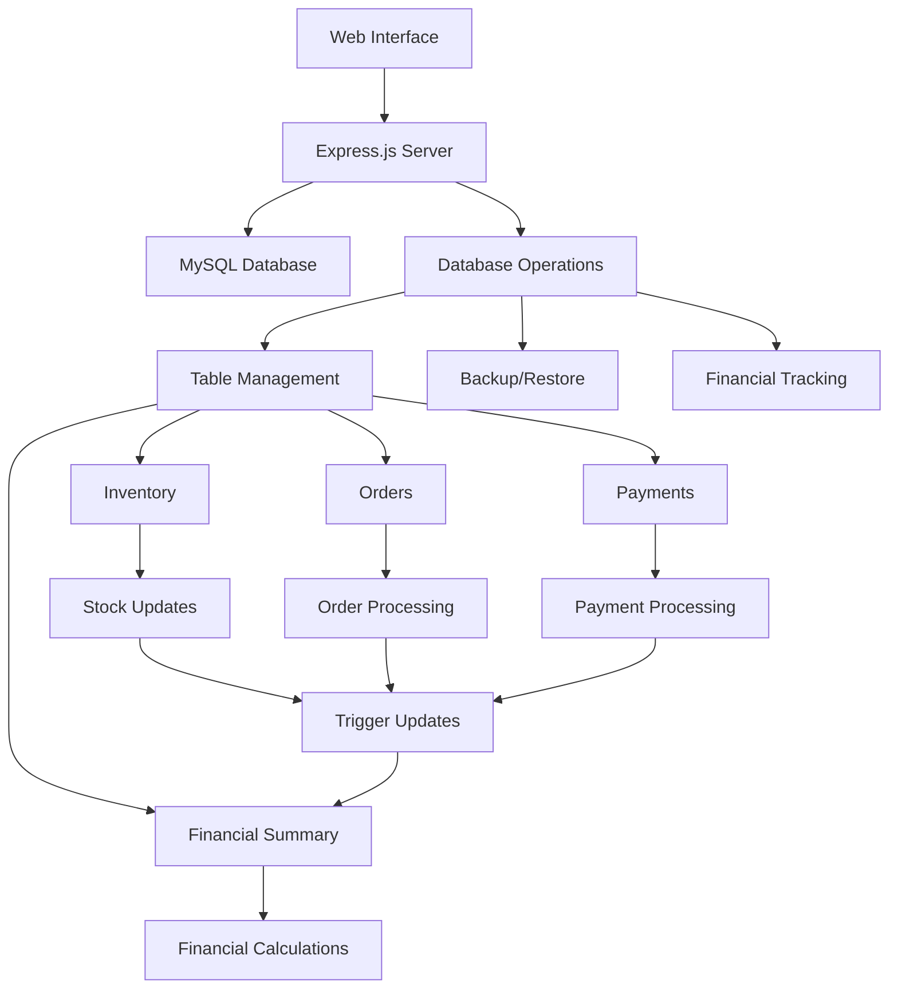
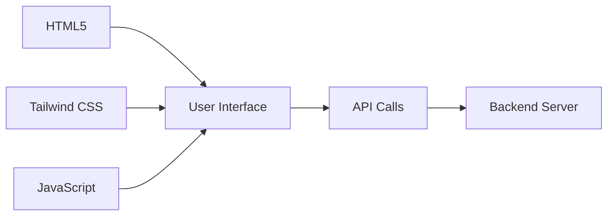
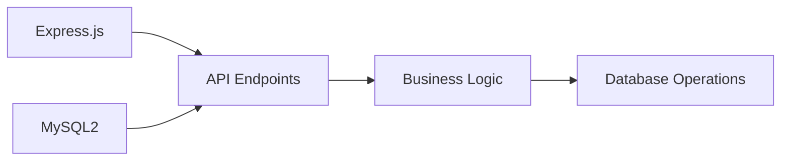
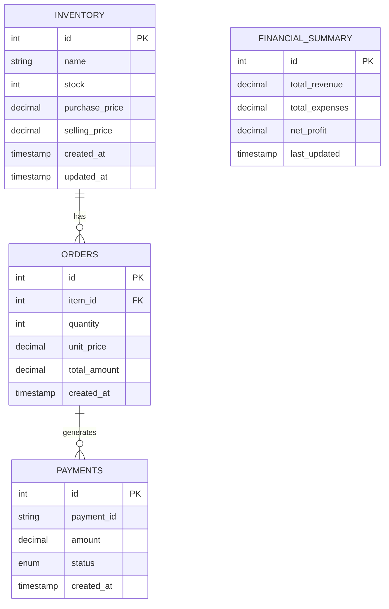

# Clothing Business Database Manager

A comprehensive web-based interface for managing your clothing business database. This application provides real-time database management, backup/restore capabilities, and financial tracking features.

## System Architecture & Flow



## Core Features

### 1. Inventory Management
- **Stock Tracking**
  - Real-time stock level monitoring
  - Low stock alerts
  - Stock history tracking
  
- **Item Management**
  - Add/Edit/Delete items
  - Bulk item operations
  - Item categorization
  - Price management (purchase/selling)
  
- **Analytics**
  - Stock turnover rates
  - Popular items tracking
  - Profit margins per item

### 2. Order Processing
- **Order Creation**
  - Quick order entry
  - Multiple item orders
  - Automatic stock deduction
  
- **Order Management**
  - Order status tracking
  - Order history
  - Order modifications
  - Cancellation handling
  
- **Order Analytics**
  - Daily/Weekly/Monthly reports
  - Order value analysis
  - Customer order patterns

### 3. Payment System
- **Payment Processing**
  - Multiple payment methods
  - Payment status tracking
  - Automatic receipt generation
  
- **Payment Management**
  - Payment history
  - Refund processing
  - Payment verification
  
- **Financial Reports**
  - Daily transaction reports
  - Payment method analysis
  - Outstanding payments tracking

### 4. Financial Management
- **Real-time Tracking**
  - Revenue monitoring
  - Expense tracking
  - Profit calculation
  
- **Financial Analysis**
  - Profit/Loss statements
  - Cash flow analysis
  - Revenue forecasting
  
- **Automated Updates**
  - Trigger-based calculations
  - Real-time financial summary
  - Automatic report generation

### 5. Database Operations
- **Backup Management**
  - Automated backups
  - Backup scheduling
  - Backup encryption
  
- **Restore Operations**
  - Point-in-time recovery
  - Selective restoration
  - Backup verification
  
- **Database Maintenance**
  - Performance optimization
  - Data cleanup
  - Index management

## Technical Implementation

### Frontend Architecture


### Backend Architecture


### Database Schema


## Installation & Setup

### Prerequisites
- Node.js (v14 or higher)
- MySQL Server (v5.7 or higher)
- npm (Node Package Manager)
- Modern web browser

### Installation Steps
1. Clone repository:
   ```bash
   git clone <repository-url>
   cd clothing-business-db-manager
   ```

2. Install dependencies:
   ```bash
   npm install
   ```

3. Configure environment:
   ```bash
   cp .env.example .env
   ```

4. Update `.env`:
   ```env
   DB_HOST=localhost
   DB_USER=clothing_user
   DB_PASSWORD=your_secure_password
   DB_NAME=clothing_business
   PORT=3000
   ```

5. Initialize database:
   ```bash
   mysql -u root -p < schema.sql
   ```

## Usage Guide

### Starting the Application
1. Development mode:
   ```bash
   npm run dev
   ```

2. Production mode:
   ```bash
   npm start
   ```

### Accessing the Interface
- Open browser: `http://localhost:3000/database_manager.html`

### Common Operations

#### 1. Inventory Management
- Add new items
  1. Click "Add Item"
  2. Fill item details
  3. Submit form

- Update stock
  1. Select item
  2. Modify stock quantity
  3. Save changes

#### 2. Order Processing
- Create order
  1. Select items
  2. Enter quantities
  3. Confirm order

- View order history
  1. Navigate to Orders
  2. Filter/sort as needed

#### 3. Payment Handling
- Record payment
  1. Select order
  2. Enter payment details
  3. Process payment

- View payment history
  1. Navigate to Payments
  2. Check payment status

#### 4. Database Management
- Create backup
  1. Click "Create Backup"
  2. Wait for completion
  3. Download if needed

- Restore database
  1. Select backup
  2. Click "Restore"
  3. Confirm action

## Security Measures

### Data Security
- Encrypted backups
- Secure credential storage
- Input validation
- SQL injection prevention

### Access Control
- Environment-based configuration
- API endpoint validation
- Error handling
- CORS protection

## Troubleshooting

### Common Issues
1. Connection Problems
   - Check MySQL service
   - Verify credentials
   - Test network connection

2. Performance Issues
   - Monitor table sizes
   - Check indexes
   - Optimize queries

3. Backup/Restore Issues
   - Verify permissions
   - Check disk space
   - Validate backup files

## Maintenance

### Regular Tasks
1. Database Maintenance
   - Regular backups
   - Index optimization
   - Log rotation

2. Application Updates
   - Package updates
   - Security patches
   - Feature updates

## Support & Contributing

### Getting Help
- Check documentation
- Review error logs
- Contact support team

### Contributing
1. Fork repository
2. Create feature branch
3. Submit pull request

## License
MIT License - see LICENSE file

## Version History
- v1.0.0: Initial release
- v1.1.0: Added financial tracking
- v1.2.0: Enhanced backup system